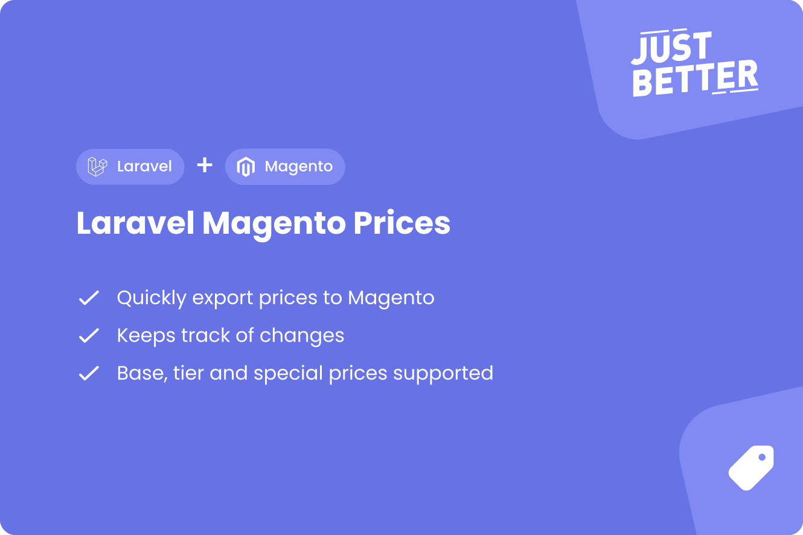

<a href="https://github.com/justbetter/laravel-magento-prices" title="JustBetter">
    
</a>

# Laravel Magento Prices

<p>
    <a href="https://github.com/justbetter/laravel-magento-prices"></a>
    <a href="https://github.com/justbetter/laravel-magento-prices"></a>
    <a href="https://github.com/justbetter/laravel-magento-prices"></a>
    <a href="https://github.com/justbetter/laravel-magento-prices"></a>
</p>

Package to send prices to Magento from a Laravel application using a configurable source.

## Features
The idea is that we want to push prices to Magento but we do not want to rewrite the logic of keeping track and updating prices to Magento.
This package can:

- Retrieve prices from any source
- Push prices to Magento (base / tier / special)
- Only update prices in Magento when are modified. i.e. when you retrieve the same price ten times it only updates once to Magento
- Search for missing prices in Magento
- Automatically stop syncing when updating fails
- Supports Magento 2 async bulk requests for updatingusing [Laravel Magento Async](https://github.com/justbetter/laravel-magento-async)
- Logs activities using [Spatie activitylog](https://github.com/spatie/laravel-activitylog)
- Checks if Magento products exist using [JustBetter Magento Products](https://github.com/justbetter/laravel-magento-products)

> Also using customer specific prices? [See our other package!](https://github.com/justbetter/laravel-magento-customer-prices)
> We also have a [Magento Client](https://github.com/justbetter/laravel-magento-client) to easily connect Laravel to Magento!

## Installation

Require this package: `composer require justbetter/laravel-magento-prices`

Publish the config: `php artisan vendor:publish --provider="JustBetter\MagentoPrices\ServiceProvider" --tag="config"`

Publish the activity log's migrations: `php artisan vendor:publish --provider="Spatie\Activitylog\ActivitylogServiceProvider" --tag="activitylog-migrations"`

Run migrations. `php artisan migrate`

> **_TIP:_** All actions in this package are run via jobs, we recommend Laravel Horizon or another queueing system to run these

### Laravel Nova

We have a [Laravel Nova integration](https://github.com/justbetter/laravel-magento-prices-nova) for this package.

## Usage

Add the following commands to your scheduler:

```php
<?php

    protected function schedule(Schedule $schedule): void
    {
        $schedule->command(\JustBetter\MagentoPrices\Commands\ProcessPricesCommand::class)->everyMinute();

        $schedule->command(\JustBetter\MagentoPrices\Commands\Retrieval\RetrieveAllPricesCommand::class)->daily();
        $schedule->command(\JustBetter\MagentoPrices\Commands\Retrieval\RetrieveAllPricesCommand::class, ['from' => 'now -2 hours'])->hourly(); // Retrieve updated
    }

```

### Retrieving Prices

This package works with a repository that retrieves prices per SKU which you have to implement.

#### Repository

This class is responsible for retrieving prices for products, retrieving sku's and settings.
Your class must extend `\JustBetter\MagentoPrices\Repository\Repository` and implement the `retrieve` method.
If there is no price for the SKU you may return `null`. In all other cases you need to return a `PriceData` object which contains four elements:
- `sku` Required
- `base_prices` Optional, array of base prices
- `tier_prices` Optional, array of tier prices
- `special_prices` Optional, array of special prices

The formats of the price arrays follows Magento's API.
You can view the rules in the `PriceData` class to get an idea of what you need to provide.

##### Example

```php

<?php

namespace App\Integrations\MagentoPrices;

use JustBetter\MagentoPrices\Data\PriceData;
use JustBetter\MagentoPrices\Repository\Repository;

class MyPriceRepository extends Repository
{
  public function retrieve(string $sku): ?PriceData
    {
        return PriceData::of([
            'sku' => $sku,
            'base_prices' => [
                [
                    'store_id' => 0,
                    'price' => 10,
                ],
                [
                    'store_id' => 2,
                    'price' => 19,
                ],
            ],
            'tier_prices' => [
                [
                    'website_id' => 0,
                    'customer_group' => 'group_1',
                    'price_type' => 'fixed',
                    'quantity' => 1,
                    'price' => 8,
                ],
                [
                    'website_id' => 0,
                    'customer_group' => '4040',
                    'price_type' => 'group_2',
                    'quantity' => 1,
                    'price' => 7,
                ],
            ],
            'special_prices' => [
                [
                    'store_id' => 0,
                    'price' => 5,
                    'price_from' => now()->subWeek()->toDateString(),
                    'price_to' => now()->addWeek()->toDateString(),
                ],
            ],
        ]);
    }
}
```

### Retrieving SKU's

By default, the `Repository` that you are extending will retrieve the SKU's from [justbetter/laravel-magento-products](https://github.com/justbetter/laravel-magento-products).
If you wish to use this you have to add the commands to your scheduler to automatically import products.

If you have another source for your SKU's you may implement the `skus` method yourself.
It accepts an optional carbon instance to only retrieve modified stock.

```php
<?php

namespace App\Integrations\MagentoPrices;

use JustBetter\MagentoPrices\Repositories\Repository;
use Illuminate\Support\Carbon;
use Illuminate\Support\Collection;

class MyPriceRepository implements Repository
{
    public function skus(?Carbon $from = null): ?Collection
    {
        return collect(['sku_1', 'sku_2']);
    }
}
```

### Configuring the repository

The repository class has a couple of settings that you can adjust:

```php
class BaseRepository
{
    // How many prices may be retrieved at once when the process job runs
    protected int $retrieveLimit = 250;

    // How many prices may be updated at once when the process job runs
    protected int $updateLimit = 250;

    // How many times an update to Magento may fail before it stops trying
    protected int $failLimit = 3;
}
```

After you've created and configured the repository you have to set it in your configuration file:

```php
<?php

return [
    'repository' => \App\Integrations\MagentoPrices\MyPriceRepository::class,
];
```

### Checking for missing prices

There is a build in action that checks all products in Magento where there is no price or the price is zero.
For each product it will automatically start an update or retrieve.

You can run this with the command: `php artisan magento-prices:process-missing-prices`

### Handling failures

When an update fails it will try again. A fail counter is stored with the model which is increased at each failure.
In the repository you can specify how many times the update may be attempted

### Events

Events that are dispatched by this package are:
- `\JustBetter\MagentoPrices\Events\UpdatedPriceEvent` - Triggered when a price is updated

### Async bulk

In order to drastically decrease the amount of requests to Magento you can enable the `async` option in the configuration file.
This will use [Laravel Magento Async](https://github.com/justbetter/laravel-magento-async) to send the update requets.
Do not forget to follow the installation guide on that package.

## Quality

To ensure the quality of this package, run the following command:

```shell
composer quality
```

This will execute three tasks:

1. Makes sure all tests are passed
2. Checks for any issues using static code analysis
3. Checks if the code is correctly formatted

## Contributing

Please see [CONTRIBUTING](.github/CONTRIBUTING.md) for details.

## Security Vulnerabilities

Please review [our security policy](../../security/policy) on how to report security vulnerabilities.

## Credits

- [Vincent Boon](https://github.com/VincentBean)
- [All Contributors](../../contributors)

## License

The MIT License (MIT). Please see [License File](LICENSE) for more information.

<a href="https://justbetter.nl" title="JustBetter">
    
</a>
